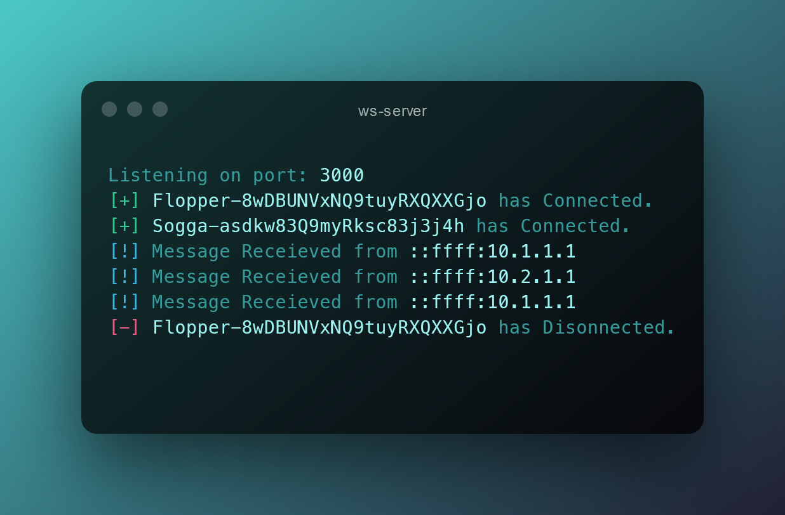

# ws-server
A WebSocket Server for a chat application. Used in [ws-react](https://github.com/ShreeyansB/ws-react).

---


## How it Works
* Client assigns itself a unique id and sets it as parameter `id` when connection to the WebSocket.
* Server parses the URL when connection is made and assigns the id to the client. Server broadcasts that a new Client has connected.
* Server pings every stored Client in the instance every few seconds. If a pong is not received back then Server broadcasts the Client has disconnected.
* When a message is received, Server adds an ISO Date String to the message and broadcasts it.

#### Message JSON structure
```js
{
    "type": "alert" / "msg", (required)
    "name": "Sender Display Name",
    "msg": "Send Message",
    "id": "Sender ID",
    "time": "2021-11-25T15:02:46.275Z"
}
```

## Usage
```bash
git clone https://github.com/ShreeyansB/ws-server
cd ws-server
npm start
```
> You may need to allow Insecure Websocket Connections in your browser settings
